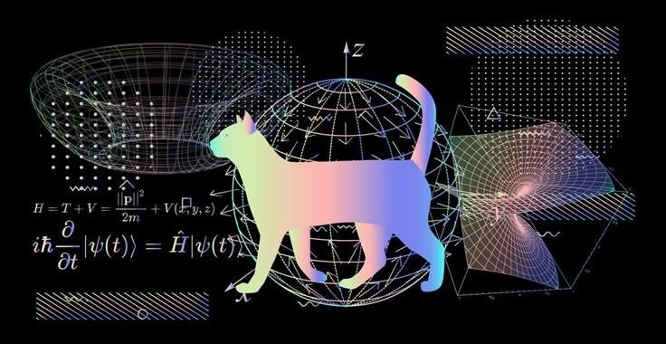

# Hi, I'm anomaly-4rc 👋 🧪⚡

> **Electronics Student / Hardware & Science Enthusiast**  
> *Fascinated by everything from quantum mechanics to cosmic scale physics. Learning Linux & Android low-level internals one tweak at a time.*

---

### 🔬 About Me & What I Love
- ⚡ **Electronics & Hardware:** Passionate about circuits, signals, and understanding how stuff works under the hood.
- 🌌 **Physics & Science:** Always curious about the universe—from quantum phenomena to astrophysics.
- 🐧 **Kernel Tinkering:** Currently learning & experimenting with custom Linux kernels (x86_64) and Android CAF (4.19) for fun.
- 📱 **Learn to create and develop APKs.**
- 💡 **Mindset:** Just a curious learner who loves breaking things to understand the logic behind them!

---

---

### 🛠️ Tech Stack & Interest Areas

---

> *"If you want to find the secrets of the universe, think in terms of energy, frequency and vibration."*  
> — **Nikola Tesla**

___

*“Curiosity is the engine of achievement.”* ☕
